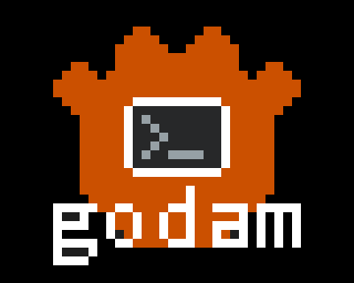

# **godam** 

**godam** (**God**ot **A**sset **M**anager) is an unofficial minimal command-line tool to manage assets from the Godot Asset Library. 

  

This command-line tool aims to operate in the same way the Godot Editor downloads and installs assets from the Godot Asset Library. The objective is to allow developers to fully omit addons from their VCS, and keep track of them using a declarative configuration file (similar to `Cargo.toml` or `package.json`)

> ⚠️ **godam** manages asset files on your computer that are scoped to relative paths under your Godot project folder. With that said, I make no guarantees I haven't made errors in my file handling logic.
>
> Use at your own discretion!

## Features ✨

This section outlines the current features available.

- Searching the Godot Asset Library API for asset IDs.
- Installing assets using the asset ID found in Godot Asset Library ID.
- Uninstalling assets using the asset ID found in Godot Asset Library ID.
- Listing all assets managed by **godam**
- Cleaning the asset cache
  
## How it works ❔

**godam** scaffolds your Godot project folder, creating a `godam.toml` file, a `.godam` cache folder and a `.gitignore` in your `addons` folder. The .gitignore sets up your git to ignore all contents of the addon folder except for the TOML configuration file.

When adding an asset using `godam install <ID>` the following happens:

1. The asset information is fetched from the Godot Asset Library API and added to the `godam.toml` file.

2. The `.godam` cache folder is checked, to see if the addon is already downloaded. If not, the zip is downloaded and saved to the cache folder.

3. The zip is crawled and the `addons` folder in the zip is copied (with all its contents) from the zip to your addons folder.

4. The asset folder name is stored in the `godam.toml`, to keep track of what asset ID is mapped to what install folder.
  
    > ⚠️ This is sort of messy, but the Godot Asset Library API does not store information about the folder structure of the zip download URL specified in the Asset Library. 
    > 
    > godam expects the zip to either directly contain the addons folder, or that the addons folder is found directly under any  folder of the zip.

5. These steps are repeated for each asset registered in the `godam.toml` file.

## Example ⚙️

Using **godam**, let us install [LimboAI for Godot 4.3](https://godotengine.org/asset-library/asset/3228):

1. If you haven't already, install the **godam** executable using `cargo install --git https://github.com/nilsiker/godam`

2. `cd` to your Godot project directory (this is were your `project.godot` file resides)   

3. Initialize your Godot project with `godam init`

4. Look up Godot Asset Library IDs using `godam search LimboAI`

5. Install the asset using `godam install 3228`

6. List **godam**-managed assets using `godam list`
 
7. Install all managed assets using `godam install`
  
8. Clean the cache using `godam clean` 

## Disclaimer 
This is not an official Godot product or service, but my personal tool for installing assets from the Godot AssetLib in a command-line environment.

Because of this, its use case is strictly scoped to my current needs.

Feel free to raise issues and provide feedback!

# Future ideas 🔮

- Release builds for Windows, macOS and Linux
- [indicatif](https://github.com/console-rs/indicatif) integration for more pleasing console printouts
- Further multi-threaded support (uninstall)
- Support asset version freeze and upgrades
- Improve codebase, enhancing maintainability and readability. This includes:
  - Removing expects
  - Giving modules clearer ares of responsibility
